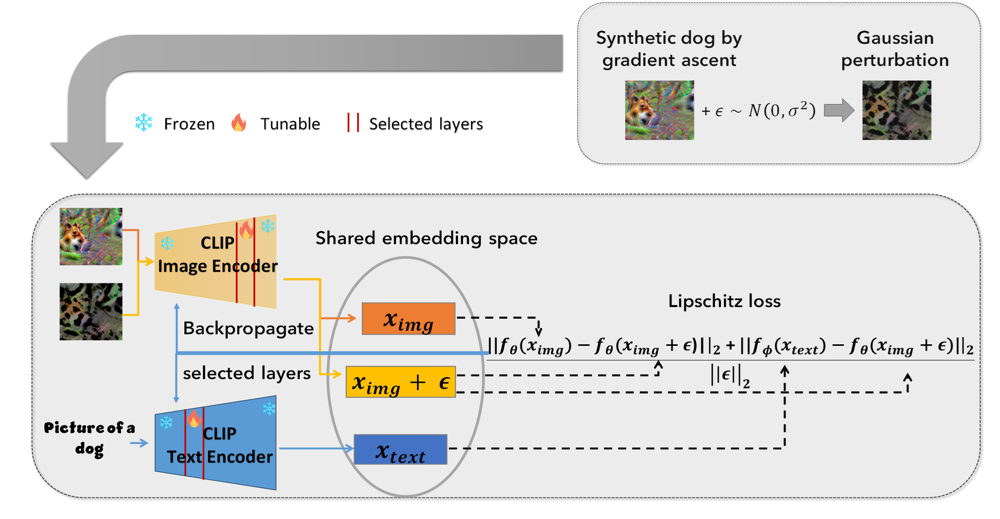

Official implementation of [Zero-Shot Class Unlearning in CLIP with Synthetic Samples](https://arxiv.org/abs/2407.07485)

The paper has been accepted by WACV 2025. 


# Introduction



Machine unlearning is a crucial area of research. It is driven by the need to remove sensitive information from models to safeguard individuals' 
right to be forgotten under rigorous regulations such as GDPR. In this work, we focus on unlearning within CLIP, a dual vision-language encoder 
model trained on a massive dataset of image-text pairs using contrastive loss. To achieve forgetting we expand the application of Lipschitz 
regularization to the multimodal context of CLIP. Specifically, we ensure the smoothing of both visual and textual embeddings associated with
the class intended to be forgotten relative to the perturbation introduced to the samples from that class. Additionally, importantly, we remove
the necessity for real forgetting data by generating synthetic samples through gradient ascent maximizing the target class. Our forgetting
procedure is iterative, where we track accuracy on a synthetic forget set and stop when accuracy falls below a chosen threshold. We employ a
selective layers update strategy based on their average absolute gradient value to mitigate over-forgetting. We validate our approach on several
standard datasets and provide thorough ablation analysis and comparisons with previous work.

# Installation
This repository requires the installation the environment and datasets:

* follow https://github.com/KaiyangZhou/Dassl.pytorch#installation to install Dassl.pytorch
* follow DATASETS.md to install the datasets.
* install package requirements in requirements.txt


### Class Unlearning

To generate synthetic samples run:

`!CUDA_VISIBLE_DEVICES=0 sh datagen.sh 'RN'/'ViT'`

To unlearn classes from CLIP run the following code:

`!CUDA_VISIBLE_DEVICES=0 sh train.sh 1 1 0 1 25 0.1 "StanfordDogs,StanfordCars,Caltech101,OxfordFlowers" 'RN50'/'ViT'`

You can choose to forget classes from 'RN50' or 'ViT-B/16' models.

Classes to forget are defined in `forget_cls.py`

### View Results

You can view the results as a pandas DataFrame using the following:

```
from clip_forget_utils import create_results
df_res, _ = create_results("results/results1/seed_0/", gen_data=True, all_res=True, rn=True/False)
```


## Acknowledgement
For this work we borrowed some code from these repos: [CLIP](https://github.com/openai/CLIP), [Information-Theoretic-Unlearning](https://github.com/jwf40/Information-Theoretic-Unlearning). Thanks a lot to the authors!